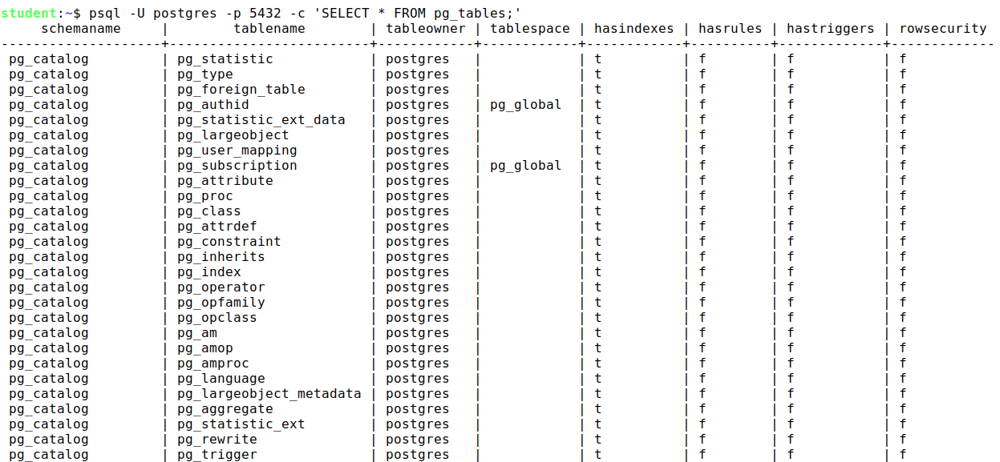
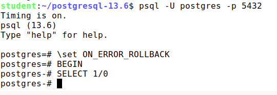

Installing PostgreSQL from source code:

`tar xzf /home/student/postgresql-13.6.tar.gz` - unpack the source code

`ls -ld /home/student/postgresql-13.6` - check the directory

`cd /home/student/postgresql-13.6` - go to the directory

`./configure --help` - check the configuration options

`./configure --prefix=/home/student/pgsql13 --with-pgport=5432` - configure the source code

`make` - compile the source code

`make install` - install the source code

Cluster creation:

`mkdir /home/student/pgsql13/data` - create a new directory for the cluster

`export PGDATA=/home/student/pgsql13/data` - set the PGDATA environment variable

`export PATH=/home/student/pgsql13/bin:$PATH` - set the PATH environment variable

Server Management:

`initdb -U postgres -k -D /home/student/pgsql13/data` - create a new cluster

`pg_ctl -D /home/student/pgsql13/data1 -l /home/student/logfile start` - start the server

`psql -U postgres -p 5432 -c 'SELECT now();'` - connect to the server and execute a query

```bash
              now              
-------------------------------
 2023-11-23 17:42:36.388934+03
(1 row)
```


Optional (if port is busy):

`sudo lsof -i :5432` - find PID

`sudo kill -9 <PID>` - kill process

## (20 points) Practice "Installation and server managment"

### Enabling checksum calculation in a cluster.
1. Stop the server.
2. Verify that checksums are being calculated in the cluster.
3. Enable checksum calculation.
4. Start the server

### Solution

1. Stop the server

    `pg_ctl -D /home/student/pgsql13/data1 -l /home/student/logfile stop`

    

2. Verify that checksums are being calculated in the cluster.

    `pg_checksums -D /home/student/pgsql13/data1 -d`

    

3. Enable checksum calculation.

    `pg_checksums -D /home/student/pgsql13/data1 -e`

    

4. Start the server

    `pg_ctl -D /home/student/pgsql13/data1 -l /home/student/logfile start`
    
## (10 points) Practice+ (optional)

1. Install PostgreSQL from source code as it is
2. Create a database cluster, start the server.
3. Verify that the server is running.
4. Stop the server.

### Solution

* I swear I did it, but I forgot to take a screenshot and cache of my terminal was full. I made it by given instructions in presentation. As proof i done first task in this homework and it's screenshot is above.

    

## (30 points) Practice "PSQL"

1. Run psql and check the information about the current connection.
2. Print all rows of the pg_tables table.
3. Set the "less -XS" command for page-by-page view and once again output all rows of pg_tables.
4. The default prompt shows the database name. Customize the prompt to additionally information about the user is displayed: role@database=#
5. Configure psql so that all commands display the duration of execution. Make sure that this setting is preserved when you run it again

### Solution

1. Run psql and check the information about the current connection.

    `psql -U postgres -p 5432 -c 'SELECT now();'`

    

2. Print all rows of the pg_tables table.

    `psql -U postgres -p 5432 -c 'SELECT * FROM pg_tables;'`

    

    On the screenshot above you can see not all rows of pg_tables table, because of my terminal.

3. Set the "less -XS" command for page-by-page view and once again output all rows of pg_tables.

    `psql -U postgres -p 5432 -c 'SELECT * FROM pg_tables;' | less -XS`

    Done and screenshot is the same as in previous task.

4. The default prompt shows the database name. Customize the prompt to additionally information about the user is displayed: role@database=#

    `export PS1='%n@%d=# '` - set the PS1 environment variable


5. Configure psql so that all commands display the duration of execution. Make sure that this setting is preserved when you run it again

    `export PGOPTIONS='--log_duration=on'` - set the PGOPTIONS environment variable

    `source ~/.bashrc` - update the environment variables

    

## (10 points) Practice+(optional)

1. Open a transaction and execute a command that terminates with any error. Verify that it is not possible to continue working in that transaction.
2. Set ON_ERROR_ROLLBACK to on and verify that you can continue executing commands within the transaction after an error.

### Solution

1. Open a transaction and execute a command that terminates with any error. Verify that it is not possible to continue working in that transaction.

    `psql -U postgres -p 5432 -c 'BEGIN; SELECT 1/0; SELECT now();'`

    

2. Set ON_ERROR_ROLLBACK to on and verify that you can continue executing commands within the transaction after an error.
    
    `psql -U postgres -p 5432 -c '\set ON_ERROR_ROLLBACK on'`
    
    
## (20 points) Practice "Configuration"

1. Get a list of parameters that require a server restart to change
2. In the postgresql.conf file, make an error when changing the max_connections parameter. Restart the server. Verify that the server does not start, and check the message log. Fix the error and start the server

### Solution

1. `psql -U postgres -p 5432 -c "SELECT name, context, vartype FROM pg_settings WHERE pending_restart;"` - get a list of parameters that require a server restart to change

    

2. `vim /home/student/pgsql13/data/postgresql.conf` - editing config file and change max_connections to 'invalid_value'

    

    `pg_ctl -D /home/student/pgsql13/data -l /home/student/logfile start` - try to start server

    

    `vim /home/student/pgsql13/data/postgresql.conf` - fix the error and start the server

    

## (10 points) Practice+ (optional)

1. Set the work_mem = 32MB parameter on the command line of the of the psql utility.
2. In the Ubuntu package distribution, the file postgresql.conf is not in the PGDATA directory. How does the server finds this configuration file at startup?

### Solution

1. `psql -U postgres -p 5432 -c "SET work_mem = '32MB';"` - set the work_mem = 32MB parameter on the command line of the of the psql utility.

    

2. `psql -U postgres -p 5432 -c "SHOW config_file;"` - show config file

    

    During startup, the PostgreSQL server follows a predefined search path to find its configuration file. The search path includes locations such as /etc/postgresql/{version}/main/ and /usr/local/pgsql/data/, among others.