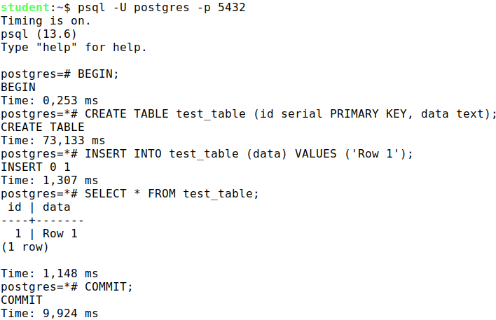
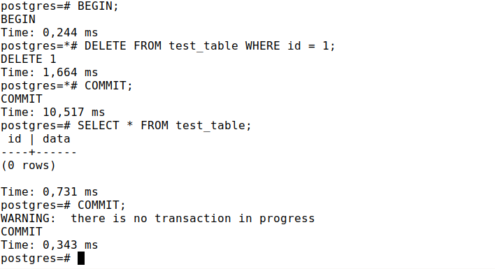
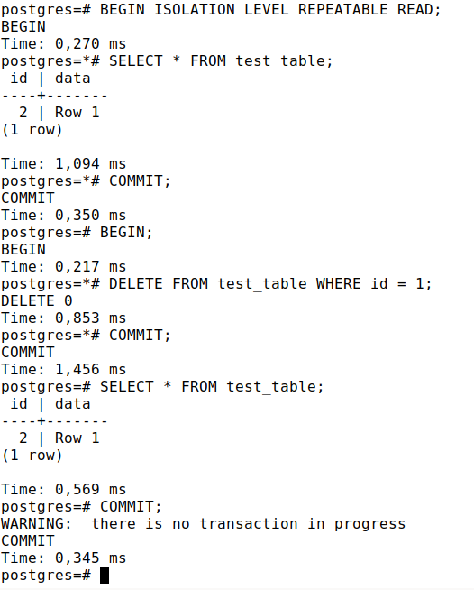

## (25 points) Practice "Isolation and multiversionality"

1. Create a table with a single row.

    Start the first transaction at the Read Committed and query the table.
    
    In the second session, delete the row and commit the changes.
    
    How many rows will the first transaction see by executing the same query again? Check.
    
    Complete the first transaction.
2. Do the same thing again, but now have the transaction running at isolation level Repeatable Read:
    
    `BEGIN ISOLATION LEVEL REPEATABLE READ;`

    Explain the differences.

### Solution

1. First transaction at the Read Committed and query the table:

    `psql -U postgres -p 5432`

    

    In the second session, delete the row and commit the changes and check the first transaction:

    

2. Both transactions at isolation level Repeatable Read:

    `psql -U postgres -p 5432`

    

    As we can see, in the first case, the transaction sees the changes made by the second transaction, and in the second case, the transaction does not see the changes made by the second transaction.

## (25 points) Practice+ "Isolation and multiversionality"(optional)

1. Start a transaction and create a new table with a single row. Without terminating the transaction, open a second session and query the table in it. Check to see what the transaction in the second session sees

    Commit the transaction in the first session and run the table query in the second session.
2. Repeat task 1, but rollback rather than commit the transaction in the first session. What has changed?
3. In the first session, start the transaction and run a query on the table you created earlier. Will you be able to delete this table in the second session while the transaction is still in progress?
    
    Check

### Solution

## (25 points) Practice "Pereodic tasks"

### Solution

## (25 points) Practice "Buffer cache"

### Solution